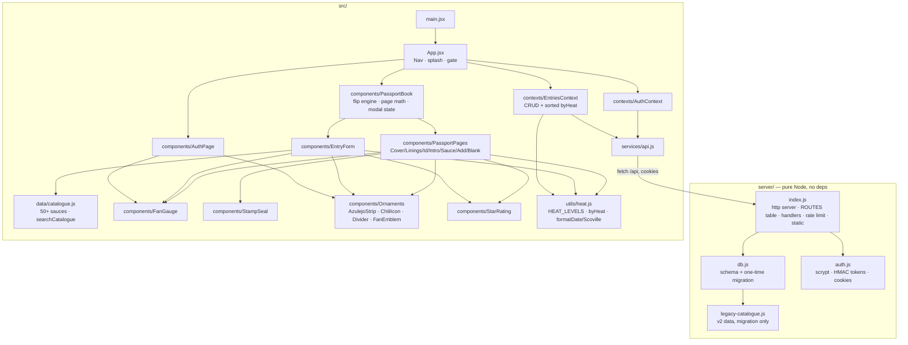

# CLAUDE.md — code graph & working notes

Pasaporte Picante: flamenco-styled passport book where users record hot sauces
they've tried; one "visa" page per sauce, ordered least → most spicy.
React + Vite frontend · zero-dependency Node 22 backend · `node:sqlite` · pnpm 11.

## Run / build (footguns first)

- **Node 22 required** (`node:sqlite`); shell default may be Node 18. Use
  `nvm use 22 && corepack enable`, or prefix `PATH="$HOME/.nvm/versions/node/v22.22.3/bin:$PATH"`.
- `pnpm dev` → API on :3001 + Vite on :5173 (Vite proxies `/api` → 3001). Use :5173 in dev.
- `pnpm build` → `scripts/build.mjs`: real Vite build locally; **auto-skipped on
  Hostinger** (cwd contains `/.builds/`, its sandbox is noexec). Env overrides:
  `SKIP_VITE_BUILD=1` / `FORCE_VITE_BUILD=1`.
- **`dist/` is committed on purpose.** Any `src/` change ⇒ rebuild + commit `dist/`
  before deploying (see DEPLOYING.md). Server-only changes don't need it.
- Server auto-enters prod mode when `dist/` exists (`IS_PROD` in server/index.js),
  so :3001 serves the *stale built* frontend during dev — normal.
- `.claude/launch.json` defines preview servers `api` (3001) and `web` (5173);
  untracked because it hardcodes the machine's nvm node path.

## Module graph

`index.css` is the whole design system (Spanish-named tokens: `--rojo`, `--oro`,
`--papel`, `--tinta`…; fonts Cinzel/Cormorant Garamond/Caveat loaded in index.html).

## Data model & API

- `entries` (one row = one passport page): `name*`, `brand`, `origin`, `peppers`,
  `heat*` 1–10, `rating` 1–5|null, `scoville` int|null, `notes`, `tried_on`
  (YYYY-MM-DD), `source_sauce_id` (v2 migration link), FK user_id.
- **Canonical order (the product):** `heat ASC, COALESCE(scoville,-1) ASC, name NOCASE ASC`
  — enforced in SQL (listEntriesHandler) *and* client (`byHeat` in utils/heat.js). Keep in sync.
- API (cookie-auth `token`, HttpOnly): `POST /api/auth/{register,login,logout}`,
  `GET /api/auth/me`, `GET|POST /api/entries`, `PUT|DELETE /api/entries/:id`.
  ROUTES entries are exact strings **or RegExps**; capture groups → handler `params`.
- Server JSON is camelCase (`triedOn`); DB is snake_case — mapped in `entryToJson`.
- Validation bounds (`parseEntryBody`): name ≤120 (required), brand/origin/peppers ≤120,
  notes ≤2000, scoville 0–16,000,000, triedOn ISO date (defaults today). PUT = full object.
- **Legacy migration runs once ever** per DB, keyed `meta['legacy_ratings_migrated']`
  (db.js). Old `ratings` × legacy-catalogue → entries. Never re-runs, so user
  edits/deletes stick. `ratings`/`favorites` tables kept read-only. Don't drop `meta`.

## Passport book mechanics (PassportBook.jsx)

- `pages = [cover, insideCover, idPage, introPage, ...sauces, addPage,
  (blankPage if interior odd), backLining, backCover]` — **always even length**;
  `FIRST_SAUCE_PAGE = 4`; sauce *i* lives at page `4 + i`.
- Desktop: sheets = consecutive page pairs; sheet k front = `pages[2k]`, back =
  `pages[2k+1]`; state `flipped` ∈ [0..sheetCount]. Page p ⇒ `flipped = ceil(p/2)`.
- **Stacking uses `translateZ(--depth: -i*1.5px)`, not z-index** — inside
  `preserve-3d`, coplanar siblings ignore z-index (bug we hit and fixed).
  rotateY(-180°) flips local z, which is what orders both stacks correctly.
- Mobile ≤860px (`SINGLE_MQ`): single-page mode via `singleIdx`; mode switch maps
  position both ways. ArrowLeft/Right flip (skipped when form open / in inputs).
- Touch: swipe left/right on `.book-zone` flips pages (observe-only handlers, no
  preventDefault; ≥48px, mostly horizontal, <600ms so scrolls/long-presses don't flip).
- After save, `pendingId` effect navigates to the entry's (possibly re-filed) page.
- Heat categories (utils/heat.js): SUAVE ≤2 · TEMPLADO ≤4 · PICANTE ≤6 ·
  ARDIENTE ≤8 · INFIERNO ≤10; fan blade ramp gold→carmine (`heatColor`).

## Deploy (Hostinger — see DEPLOYING.md for full flow)

Two paths. **Managed Node.js hosting:** hPanel Node 22.x · env `JWT_SECRET`
(server refuses to start in prod without it), `NODE_ENV=production` ·
install/build/start commands are locked but succeed by design
(pnpm-workspace.yaml disables esbuild postinstall; build.mjs skips; server
serves committed `dist/`). **VPS:** systemd + nginx; templates in `deploy/`
(`.service`, `nginx.conf`, `deploy.sh`, env example), walkthrough in
DEPLOYING.md. Zero runtime deps + committed `dist/` ⇒ no build/install on the
box; just Node 22 + run. HTTPS is required (auth cookie is `Secure` in prod).
SQLite file at `data/` — back up before redeploys.

## Gotchas checklist

- Editing `src/` → `pnpm build` + commit `dist/` or the deploy ships stale UI.
- New API routes: add to `ROUTES`; remember CORS methods header lists allowed verbs.
- `useLocalStorage`, Express routes = removed in v3; don't reintroduce. v2's
  *ratable* catalogue is gone for good — `src/data/catalogue.js` is quick-add
  autocomplete data ONLY (prefills EntryForm; entries stay user-owned rows).
- Google Fonts come from CDN (index.html); offline dev falls back to system serif.
- Tests: `pnpm test` → Node's built-in runner (zero deps) over `tests/*.test.js`.
  Each file = own process + throwaway SQLite (helpers.js sets `DB_PATH` before
  importing the server; index.js exports `server` and only auto-listens as main).
  api.test.js budget: stay under 20 auth calls/file (rate limit is per-process).
- CI (`.github/workflows/ci.yml`): push/PR → tests + build + **stale-dist check**
  (fails if committed `dist/` ≠ fresh build). CD (`deploy.yml`): publishing a
  GitHub Release (or manual dispatch) → CI gate → SSH `deploy.sh` on the VPS via
  command-restricted key (secrets `VPS_SSH_KEY`/`VPS_HOST`) → live smoke check.
  Release = `gh release create vX.Y.Z --generate-notes`.
- Manual UI checks still via `.claude/launch.json` preview servers (register a
  fresh user; local DB is gitignored).
